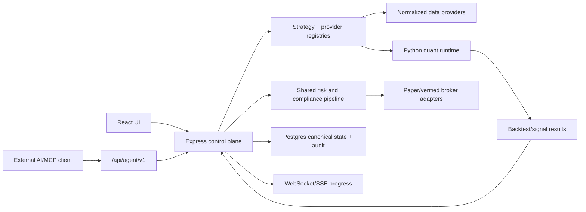

# QuantDinger Capability Integration Design

**Date:** 2026-06-27

**Status:** Approved by workspace autonomy directive; implementation pending

**Reference snapshot:** `brokermr810/QuantDinger` v4.0.1, Apache-2.0 backend

**Target:** Hermes AI Trading Terminal (`StockAnalyzeAIConnect`)

## 1. Outcome

Hermes will absorb the useful backend concepts from QuantDinger without embedding a
second product stack. The completed system will provide:

1. Versioned, user-owned strategy definitions with deterministic validation.
2. Vectorized indicator strategies and event-driven script strategies.
3. Server-side backtests whose execution assumptions are explicit and auditable.
4. Pluggable market, news, macro, and fundamentals data providers with provenance,
   freshness, cache, rate-limit, and fallback metadata.
5. A registered AI tool/skill surface for research, strategy generation, validation,
   backtesting, and supervised execution.
6. A stable agent API with scoped tokens, idempotency, rate limits, audit logs,
   instrument allowlists, and paper-only defaults.
7. Multi-user isolation for agent state, strategy runs, positions, and broker sessions.
8. A single risk and order path shared by humans, AI agents, backtests, paper trading,
   and any future verified live adapters.

The integration is complete only when these capabilities are exposed through Hermes,
covered by automated tests, documented, and proven by end-to-end paper-trading flows.

## 2. Source and License Boundary

The reference URL supplied by the user contains an extra `and`. The public repository
used for analysis is `https://github.com/brokermr810/QuantDinger`.

QuantDinger's backend is Apache License 2.0. Hermes may reuse or adapt backend concepts
and code when required notices are preserved. QuantDinger-Vue uses a separate
source-available license with commercial restrictions. This design therefore:

- does not copy QuantDinger-Vue source, branding, assets, or layouts;
- keeps Hermes React UI and visual identity;
- records any substantially adapted Apache-2.0 backend source in `NOTICE`;
- prefers clean, native implementations against Hermes contracts when the reference
  implementation is tightly coupled to Flask, Redis, CCXT, or QuantDinger's schema.

## 3. Current-State Findings

Hermes already has useful foundations:

- Express and HttpOnly-cookie authentication;
- Drizzle/Postgres persistence;
- a React AutoTrading workspace;
- a signal fusion model covering AI, RSI/MACD/Bollinger, institutional flow,
  TimesFM, and an optional quantum signal;
- server-side backtesting with stop-loss, take-profit, trailing stop, slippage,
  liquidity caps, drawdown, and risk-adjusted scoring;
- a Python FastAPI science service reached over HTTP;
- a broker adapter interface and paper broker;
- kill switch, circuit breaker, notifications, and order persistence.

The main gaps are structural:

- `autonomousAgent.ts` is a process-level singleton and is not multi-tenant safe;
- strategy records contain free-form script text but no runtime, version, validation,
  parameter schema, immutable snapshot, or lifecycle contract;
- live and backtest paths share some signal math but not a complete execution model;
- backtests are synchronous and several API surfaces duplicate behavior;
- the AI `execute_backtest` tool is still a placeholder;
- data providers are called directly and do not share provenance, freshness, fallback,
  rate-limit, or circuit-breaker contracts;
- broker adapters other than simulated execution are not verified for live use;
- agent calls use the user JWT surface and lack separate scoped tokens and audit rules;
- automated coverage is sparse around trading behavior.

## 4. Chosen Architecture

### 4.1 Hybrid control plane and quant runtime

Hermes remains the product and control plane:

- React UI
- Express REST and WebSocket APIs
- HttpOnly-cookie user sessions
- Agent Gateway authentication
- Drizzle/Postgres state
- strategy lifecycle and run orchestration
- provider registry and normalized data contracts
- risk policy, order routing, audit, and notifications

The existing Python science service becomes a bounded quant execution plane:

- vectorized `IndicatorStrategy` validation and execution;
- event-driven `ScriptStrategy` sandbox and backtest execution;
- deterministic indicator calculations that benefit from pandas/numpy;
- cross-sectional ranking;
- optional TimesFM and quantum calculations already hosted there.

The Python runtime never owns users, broker credentials, orders, or canonical strategy
state. It accepts immutable run requests and returns normalized results. Express
authorizes, persists, audits, and decides whether an output may reach the shared risk
and order pipeline.

### 4.2 Why not embed the complete QuantDinger stack

A complete Flask/Postgres/Redis sidecar would create two authentication systems, two
strategy stores, two order models, and two operational control planes. A TypeScript-only
rewrite would make safe Python strategy execution and pandas-compatible research
needlessly difficult. The hybrid keeps one product state while using Python where it is
the natural strategy runtime.

## 5. Domain Components

### 5.1 Strategy Registry

Each strategy has:

- `id`, `userId`, `name`, `description`;
- `runtime`: `indicator` or `script`;
- immutable `version`;
- source code and SHA-256 source hash;
- typed parameter schema and default parameters;
- execution policy: direction, entry sizing, exit owner, stop-loss, take-profit,
  trailing stop, and position limits;
- validation status and diagnostics;
- lifecycle status: `draft`, `validated`, `paper`, `paused`, or `archived`;
- provenance: `human`, `ai`, or `imported`;
- timestamps and optional parent version.

Editing creates a new version. Backtests and runs reference an immutable version so
results remain reproducible.

### 5.2 Strategy Contracts

`IndicatorStrategy` receives normalized OHLCV frames and parameters. It returns aligned,
finite signal arrays:

- two-way: `buy`, `sell`; or
- four-way: `open_long`, `close_long`, `open_short`, `close_short`;
- optional plots and markers;
- optional cross-sectional scores and rankings.

`ScriptStrategy` exposes only a restricted runtime:

- `on_init(ctx)`;
- `on_bar(ctx, bar)`;
- deterministic state scoped to the run;
- `ctx.buy`, `ctx.sell`, `ctx.close_position`, and read-only account/position views;
- no filesystem, process, socket, package installation, dynamic import, or environment
  access.

Source validation rejects look-ahead constructs, forbidden imports, unbounded resource
requests, malformed signals, missing functions, and ambiguous exit ownership.

### 5.3 Backtest Service

Backtests become asynchronous jobs:

1. Express validates ownership, strategy version, parameters, symbol policy, and limits.
2. A market-data snapshot is resolved and persisted with provider metadata.
3. Express submits an immutable run request to Python.
4. Python validates and executes the strategy under time and memory budgets.
5. The shared execution model applies fees, slippage, liquidity, sizing, stops,
   trailing exits, and direction rules.
6. Express persists results and an audit event.
7. REST polling and SSE expose progress and the final result.

Required result fields include equity, drawdown, orders, fills, trades, exposure,
turnover, win rate, profit factor, Sharpe-like and downside-risk metrics, assumptions,
warnings, strategy hash, data snapshot hash, provider provenance, and engine version.

No live LLM call occurs inside a historical backtest. AI may generate or review a
strategy before a run and explain results afterward, but the run itself is reproducible.

### 5.4 Data Provider Registry

All providers implement normalized operations such as:

- `quote`
- `bars`
- `fundamentals`
- `news`
- `macroSeries`
- `economicCalendar`
- `search`

Every response carries:

- provider and provider version;
- retrieval timestamp and market timestamp;
- freshness and delayed/realtime classification;
- cache status;
- fallback chain;
- warnings and partial-data fields;
- normalized symbol and market.

The first integration reuses Hermes providers and adds registry contracts around them:

- Taiwan: TWSE/TPEX and existing local services;
- global equities and FX: Yahoo Finance fallback;
- technical snapshot: TradingView service;
- US filings: SEC EDGAR;
- institutional/insider/congressional research: current Hermes research routes;
- crypto: public exchange/CCXT-compatible market-data adapters only after dependency
  review;
- macro: FRED, BLS, BEA, and Trading Economics adapters when configured;
- news/search: Yahoo, GDELT, Alpha Vantage, and SearXNG-style adapters when configured.

Provider additions are configuration-driven. Missing credentials degrade the relevant
provider only; they never fabricate data.

### 5.5 AI Tool and Skill Registry

AI capabilities are explicit registered tools rather than prompt-only promises:

- resolve symbol/entity;
- fetch market snapshot;
- fetch news, fundamentals, and macro context;
- create a draft strategy;
- validate strategy source;
- run and inspect a backtest;
- compare strategy versions;
- explain risk and data gaps;
- start or stop a paper strategy run;
- inspect portfolio and open paper orders.

Skills describe which tools, inputs, outputs, and risk class apply to a workflow.
Initial skills cover market research, news research, macro research, indicator strategy,
script strategy, strategy validation, backtest review, data-source diagnosis, and
paper-trading supervision.

LLM providers remain behind the existing model router. Tool results are structured
facts with provenance. The LLM may interpret them but may not invent missing provider
results or bypass validation and risk gates.

### 5.6 Agent Gateway

`/api/agent/v1` is separate from browser JWT routes. It is a thin contract over the same
Hermes services.

Capability classes:

- `R`: read market, research, strategy, portfolio, and job data;
- `W`: create or update workspace drafts;
- `B`: run bounded backtests and experiments;
- `T`: paper-trading commands; live use remains unavailable until a broker adapter
  passes a separate sandbox-verification project.
- `A`: token and audit administration.

Agent tokens are random, prefixed, shown once, and stored as hashes. They include user,
scopes, expiry, rate limit, optional market/instrument allowlists, and `paperOnly=true`
by default.

`W`, `B`, and `T` requests require an idempotency key. Every call records token prefix,
user, route, risk class, request hash, result status, latency, and created resource IDs.
Secrets, prompts containing credentials, and raw broker credentials are redacted.

### 5.7 Multi-Tenant Trading Sessions

The singleton agent is replaced with a `TradingSessionRegistry` keyed by user and run.
Each session owns:

- configuration;
- scheduler and in-flight lock;
- position/peak tracking;
- loss streak and circuit-breaker state;
- selected broker session;
- recent price series;
- logs and metrics.

Process restart restores all `running` and `cooldown` sessions. Broker reconciliation is
explicit, and an empty broker response cannot silently erase local position protection.

### 5.8 Shared Risk and Order Pipeline

All order intents flow through:

`strategy/agent/human -> normalized intent -> compliance gate -> risk gate ->
paper/live policy -> broker adapter -> order ledger -> reconciliation -> notification`

Mandatory properties:

- paper-only default;
- strategy version and decision provenance on every order;
- stop-loss before ordinary entry execution;
- take-profit and trailing-stop ownership cannot be duplicated;
- position, daily-loss, concurrent-position, sector, liquidity, and stale-data limits;
- idempotent submission;
- append-only lifecycle audit;
- kill switch that cancels orders and attempts flattening, with explicit failures;
- no replacement of the simulated adapter with a live adapter without independent
  sandbox evidence and operator acknowledgment.

## 6. Data Flow

## 7. Failure Handling

- Provider timeout: try only the configured fallback chain and retain warnings.
- Stale or partial data: mark it explicitly; trading policy may convert the decision to
  HOLD.
- Python runtime unavailable: fail strategy validation/backtest jobs cleanly; existing
  UI and manual portfolio features remain available.
- Strategy timeout or resource breach: terminate the run and persist diagnostics.
- Invalid AI output: schema validation failure; no implicit coercion into an order.
- Duplicate command: return the stored idempotent result.
- Broker uncertainty: mark the order `UNKNOWN`, stop retries that could duplicate an
  order, and reconcile by broker ID.
- Database unavailable: reject state-changing trading or agent commands.
- Session crash: isolate it to one user/run and restore from persisted state.

## 8. Security Constraints

- No user strategy executes in the Express process.
- Python strategy execution has an explicit forbidden-import policy, resource budget,
  payload size limit, and deterministic clock/random policy.
- User JWTs never authorize Agent Gateway calls; agent tokens never authorize browser
  session routes.
- Credentials remain server-side and are not included in LLM prompts or tool output.
- Agent-created strategies start as drafts.
- Agent-created trading runs start in paper mode.
- Live broker activation is outside this integration until adapters are verified.
- The existing proactive stop-loss, cooldown restoration, hedge direction semantics,
  and simulated-adapter safeguards remain invariants.

## 9. Testing Strategy

### Contract tests

- normalized provider responses and fallback metadata;
- strategy request/result schemas across TypeScript and Python;
- Agent Gateway scopes, token hashing, idempotency, and audit redaction;
- broker/order lifecycle and reconciliation.

### Strategy tests

- two-way and four-way signal semantics;
- long, short, and both directions;
- engine-owned versus strategy-owned exits;
- no look-ahead and aligned signal lengths;
- deterministic replay from strategy and data snapshot hashes;
- cross-sectional ranking and rebalance behavior.

### Backtest/live parity tests

Replay the same bars through backtest and paper execution. With identical execution
assumptions, intents and fills must match within documented timing and rounding rules.

### Risk tests

- stop-loss precedes ordinary order execution;
- paper-only and instrument allowlists cannot be bypassed;
- stale data forces HOLD where configured;
- kill switch, cooldown restoration, sector and position caps;
- multi-user state cannot cross session boundaries.

### End-to-end tests

- create strategy -> validate -> backtest -> inspect -> start paper run -> receive
  decision/fill/audit events -> stop;
- issue scoped agent token -> read data -> create draft -> run async backtest -> prove
  trading denial without `T`;
- two users run independent paper sessions concurrently.

## 10. Delivery Sequence

### Phase 1 — Foundations and parity

- schema migrations for versions, jobs, snapshots, sessions, and audit;
- shared TypeScript/Python contracts;
- Python runtime health, validation, and deterministic backtest endpoints;
- strategy registry and two runtime modes;
- regression tests around existing signal/risk behavior.

### Phase 2 — Data provenance

- provider registry, cache, rate limit, circuit breaker, and health diagnostics;
- wrap current Yahoo, TradingView, TWSE, and research providers;
- add configured macro/news providers without new hard requirements.

### Phase 3 — AI tools and Agent Gateway

- tool/skill registry;
- replace placeholder AI backtest tool;
- agent tokens, scopes, idempotency, audit, jobs, SSE;
- optional MCP wrapper only after REST contracts stabilize.

### Phase 4 — Multi-tenant paper operation

- replace the process singleton with per-user trading sessions;
- strategy lifecycle and paper scheduler;
- reconciliation and parity tests;
- UI integration for strategy versions, validation, jobs, provenance, and audit.

### Phase 5 — Hardening and release evidence

- load, failure, security, and migration tests;
- complete operator and strategy-author documentation;
- Apache NOTICE review;
- lint, typecheck, unit, integration, end-to-end, and production build;
- update the project knowledge graph.

## 11. Explicit Non-Goals

- copying QuantDinger-Vue;
- deploying a second Flask product database;
- promising support for every QuantDinger broker or exchange;
- enabling real-money execution through unverified Hermes broker placeholders;
- allowing an LLM to place orders outside registered tools and the shared risk path;
- claiming identical implementation details where Hermes can provide the same capability
  through a smaller native contract.

## 12. Acceptance Criteria

The goal is satisfied only when all of the following are evidenced:

- both strategy runtimes work through Hermes APIs and UI;
- imported reference templates have native equivalents or documented exclusions;
- backtests are deterministic, asynchronous, persisted, and provenance-rich;
- current data sources are registered and additional configured providers degrade safely;
- AI research and strategy workflows call real tools, including a real backtest tool;
- Agent Gateway security, idempotency, audit, and paper-only enforcement pass tests;
- two concurrent users cannot observe or mutate each other's trading session state;
- every order path uses the shared risk pipeline;
- live broker placeholders remain disabled;
- migrations, documentation, license notices, lint, tests, and production build pass;
- graphify is updated, or the missing graphify installation/output is documented as a
  verification gap rather than silently ignored.
