# 🟢 綠界科技 (ECPay) 金流整合指南

本文件詳細說明了系統中 ECPay 的實作架構、完整付款流程，以及相關的環境參數設定。

## 1. 系統架構與流程

我們實作了標準的**前端跳轉 + 後端 S2S (Server-to-Server) 驗證**流程。這是目前最安全、最標準的第三方金流接法。

### 📌 完整時序圖 (Sequence Flow)

```mermaid
sequenceDiagram
    actor User as 用戶
    participant Client as React 前端
    participant Server as Node.js 後端
    participant DB as PostgreSQL DB
    participant ECPay as 綠界伺服器

    User->>Client: 點擊「升級 Pro」
    Client->>Server: POST /api/payment/ecpay/checkout { planId }
    Server->>DB: INSERT INTO payment_orders (狀態: pending)
    Server->>Server: 計算 CheckMacValue 雜湊
    Server-->>Client: 回傳 HTML 表單 (Auto-Submit)
    Client->>ECPay: 瀏覽器自動 POST 表單至綠界
    ECPay-->>User: 顯示信用卡輸入頁面
    User->>ECPay: 輸入卡號並完成 3D 驗證
    
    rect rgb(0, 50, 0)
        Note over Server,ECPay: 非同步背景通知 (Webhook)
        ECPay->>Server: POST /api/payment/ecpay/notify (帶有結果與檢查碼)
        Server->>Server: 驗證 CheckMacValue
        Server->>DB: UPDATE payment_orders (狀態: success)
        Server->>DB: UPDATE users (subscription_tier = 'pro')
        Server-->>ECPay: 回傳 "1|OK"
    end
    
    ECPay-->>Client: 將用戶導向 /api/payment/ecpay/return
    Client-->>User: 顯示「付款成功」畫面並導回首頁
```



## 2. 資料庫 Schema (`payment_orders`)

為了防止 Vercel Serverless 冷啟動導致記憶體資料遺失，我們已將原本的 `Map` 替換為 PostgreSQL 資料表 `payment_orders`。

**Drizzle ORM 定義 (位於 `src/db/schema.ts`)：**
```typescript
export const paymentOrders = pgTable('payment_orders', {
  id:              serial('id').primaryKey(),
  merchantTradeNo: text('merchant_trade_no').notNull().unique(), // 綠界訂單編號 (限 20 碼)
  userId:          uuid('user_id').notNull().references(() => users.id, { onDelete: 'cascade' }),
  planId:          text('plan_id').notNull(),                    // 對應的方案 (如 pro_monthly)
  status:          text('status').notNull().default('pending'),  // 狀態: pending / success / failed
  amount:          numeric('amount').notNull(),                  // 訂單金額 (NTD)
  createdAt:       timestamp('created_at').defaultNow().notNull(),
  updatedAt:       timestamp('updated_at').defaultNow().notNull(),
});
```

## 3. 環境變數設定 (`.env`)

金流模組依賴以下環境變數。如果是本地開發，預設會使用綠界提供的**測試用 (Sandbox) 帳號**。

```env
# ─── ECPay 綠界金流 ───
# 測試環境帳號 (直接可用，不需申請)
ECPAY_MERCHANT_ID=2000132
ECPAY_HASH_KEY=5294y06JbISpM5x9
ECPAY_HASH_IV=v77hoKGq4kWxNNIS

# 環境切換：sandbox (測試機) | production (正式機)
ECPAY_ENV=sandbox

# ─── 回呼網址設定 ───
# 綠界伺服器需要打回你的 Server，所以必須是公開網址
APP_BASE_URL=https://your-domain.com 
```

> **⚠️ 本機開發測試注意**：
> 綠界的 Server 無法打進你的 `localhost:3000`，因此如果要在本機測試完整的付款成功 (Notify) 流程，請使用 [ngrok](https://ngrok.com/)。
> 指令：`ngrok http 3000`
> 然後將 `.env` 裡的 `APP_BASE_URL` 改為 ngrok 產生的 URL（例如：`https://abcdef123.ngrok.app`）。

## 4. 核心參數詳解

在 `server/api/ecpay.ts` 建立訂單時，我們傳遞了以下核心參數給綠界：

| 參數名稱 | 說明 | 實作方式 |
|---------|------|----------|
| `MerchantID` | 商店代號 | 由 `.env` 讀取 |
| `MerchantTradeNo` | 你的訂單編號 | `Q + Timestamp + UserID` (必須唯一，限20碼) |
| `MerchantTradeDate` | 訂單時間 | 格式嚴格要求為 `YYYY/MM/DD HH:mm:ss` |
| `TotalAmount` | 交易金額 | NTD，必須為整數 |
| `TradeDesc` | 交易描述 | 會出現在綠界後台，需 URL Encode |
| `ItemName` | 商品名稱 | 例如 "深入分析模型 - 月付" |
| `ReturnURL` | **幕後通知網址** | 指向 `/api/payment/ecpay/notify`，綠界用來通知你付款成功。 |
| `OrderResultURL`| **前端返回網址** | 指向 `/api/payment/ecpay/return`，用戶付完款後被導向的頁面。 |
| `CheckMacValue` | 安全檢查碼 | 使用 HashKey 與 HashIV 搭配全部參數透過 SHA256 產生的簽章，防止訂單被篡改。 |

## 5. 測試卡號 (Sandbox)

在測試環境下，當你被導向綠界付款頁面時，可以使用以下測試卡號進行模擬付款：

*   **卡號**：`4311-9522-2222-2222`
*   **有效年月**：未來的任何時間（例如 `12 / 30`）
*   **末三碼 (CVV)**：`222`
*   **OTP 驗證碼**：隨便填寫皆會通過。

## 6. 上線正式環境 (Production) 準備事項

當你需要將系統發布上線並開始收錢時，請完成以下步驟：

1.  登入 [綠界廠商管理後台](https://vendor.ecpay.com.tw/)。
2.  前往 **系統開發管理 > 系統介接設定**，獲取你專屬的 `MerchantID`、`HashKey` 與 `HashIV`。
3.  在 Vercel (或你的伺服器) 的環境變數中更新這些值。
4.  將 `ECPAY_ENV` 設為 `production`。
5.  確保 `APP_BASE_URL` 是你正式的網域。
